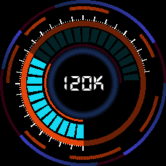

# Fink watch

This repository contains the script to display the number of alerts per night processed by Fink in real-time. The watch uses a raspberry pi to control the LCD Display Module, and get alert information from the Fink Kafka cluster.

## Display

screenshot with arrow

picture of the real thing

## Local testing

## Deployment on a Raspberry

