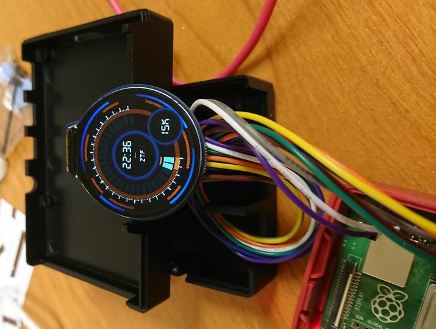

# Fink watch

This repository contains the script to display the number of alerts per night processed by the astronomical broker [Fink](https://fink-broker.org) in real-time. The watch uses a Raspberry Pi to control the LCD Display Module, and it polls alert information from the Fink Kafka cluster.

## Display



## Hardware requirements

The Fink watch is made of a [Raspberry Pi](https://www.raspberrypi.com/) board, and the [1.28inch LCD Display Module](https://www.waveshare.com/wiki/1.28inch_LCD_Module) from Waveshare. It requires internet access to poll alert information. 

While it should work on any version of the Raspberry Pi, we have only extensively tested it on a Raspberry Pi 4 running a 64-bit operating system. We plan to test it on a Raspberry Pi Zero with a 32-bit operating system at some point.

The code currently only works for a 240x240 screen. If you want to use a different resolution, you will need to adapt the code provided in `lib/LCD_1inch28.py`. Please note that this part of the library is based on examples provided by Waveshare:

```bash
wget https://files.waveshare.com/upload/8/8d/LCD_Module_RPI_code.zip
``` 

## Installation

First, clone this repository:

```bash
git clone https://github.com/JulienPeloton/fink-watch.git
```

### Demo mode

For local debugging, you only need to install the Python dependencies (tested for Python > 3.9):

```bash
python -m venv watchenv
source watchenv/bin/activate

pip install .
```

### Raspberry Pi

You need to enable the SPI interface on the Raspberry first:

```bash
sudo raspi-config
# Choose Interfacing Options -> SPI -> Yes  to enable SPI interface
```

Then reboot the Raspberry to activate the change. Then install the latest version of WiringPi from the release:

```bash
# Adapt with the latest version, and your platform
wget https://github.com/WiringPi/WiringPi/releases/download/3.12/wiringpi_3.12_arm64.deb

sudo dpkg -i wiringpi_3.12_arm64.deb
```

Check that you have access to gpio:

```bash
gpio -v
# should print version, and details about the board
```

Finally install Python dependencies:

```bash
python -m venv watchenv
source watchenv/bin/activate

pip install .
```

## Usage

We provide a Python script `app.py` with options to ease the configuration of the watch:

```bash
usage: app.py [-h] [--demo] [-width WIDTH] [-height HEIGHT] [-display DISPLAY]
              [-observatory OBSERVATORY] [-alert_per_deg ALERT_PER_DEG] [-topic TOPIC]

Launch the Fink watch

options:
  -h, --help            show this help message and exit
  --demo                If specified, display a fix image on the local computer instead of
                        the LCD screen
  -width WIDTH          Width size in pixels. Default is 240
  -height HEIGHT        Height size in pixels. Default is 240
  -display DISPLAY      What to display on screen: watch, logo. Default is watch.
  -observatory OBSERVATORY
                        Name of the observatory to set the local time for the `clock`
                        option. Default is ZTF.
  -alert_per_deg ALERT_PER_DEG
                        Number of alerts per degree (for the alertmeter). Default is 1000
  -topic TOPIC          Topic name to read alerts. Default is fink_ztf_<YYYYMMDD>.
```

### Static demo

<p float="center">
  
  
</p>

You can simply call the script using:


```bash
python app.py --local
```

And you should see a similar display than the screenshots above. This is quite useful for testing and debugging.

## Deployment on the screen using the Raspberry

Simply execute the script, and set arguments if need be:

```bash
# default display is for ZTF
python app.py


# Switch to Rubin
python app.py -observatory rubin -alert_per_deg 10000 -topic <the_topic_name_for_rubin>
```

## Troubleshooting

### Kafka: \_TIMED_OUT_QUEUE

If you get the error signal `cimpl.KafkaException: KafkaError{code=_TIMED_OUT_QUEUE}`, this means you've been disconnected from the Kafka cluster by the server. Just relaunch the watch.

## Acknowledgments

- Waveshare for providing part of the library to interact with the LCD module.
- [HadrienG2](https://github.com/HadrienG2) for providing the cool project name!
